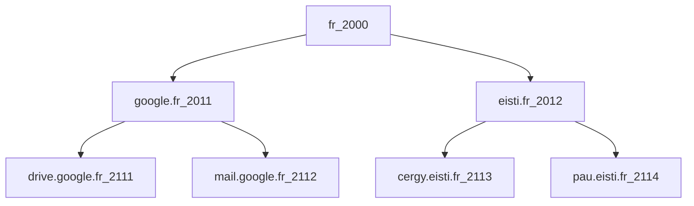

# DNS
TCPClient iteratively searching for the TCPServer in a server tree

## Description

The program (specifically, TCPClient) uses iterative approach to search for the TCPServer in a server tree presented further.
A server tree with available port numbers for client and servers, and server names to search is described as a following mermaid graph (```<name>_<port number accordingly>```):

  
Servers are created according to the structure described in JSON files located in src/main/java/dns/json/. Each file contains a port number of its corresponding server in the file name, such as server2000.


## Running the program

Server must be launched before client.

### Server
Run server as:  
```bash 
  java -jar TCPServer.jar <port number for server> &
```

Example:
```bash
  java -jar TCPServer.jar 2000 &
  java -jar TCPServer.jar 2012 &
  java -jar TCPServer.jar 2113 &
```

### Client
Run client as:  
```bash 
  -jar TCPClient.jar <port number for client> <server name to search>
```
Example:
```bash
  java -jar TCPClient.jar 2113 fr
```
	
> **NOTE**: for available port numbers for clients and servers, and server names to search, refer to Description part of this document.


## Future Work
Implement parent to child movement in the server tree.
